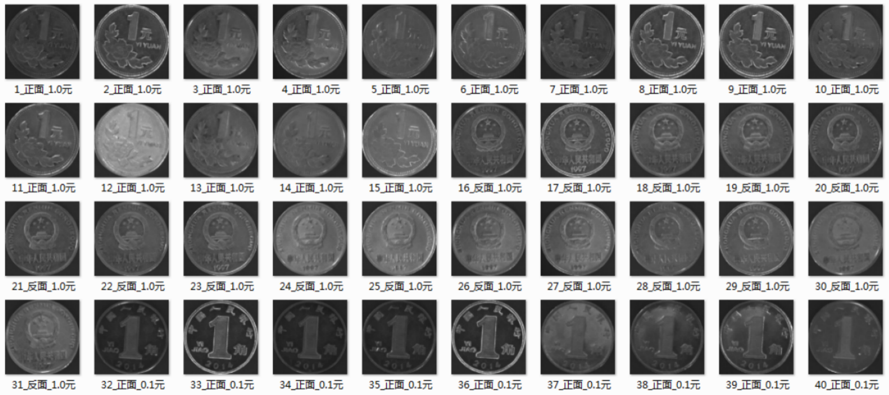
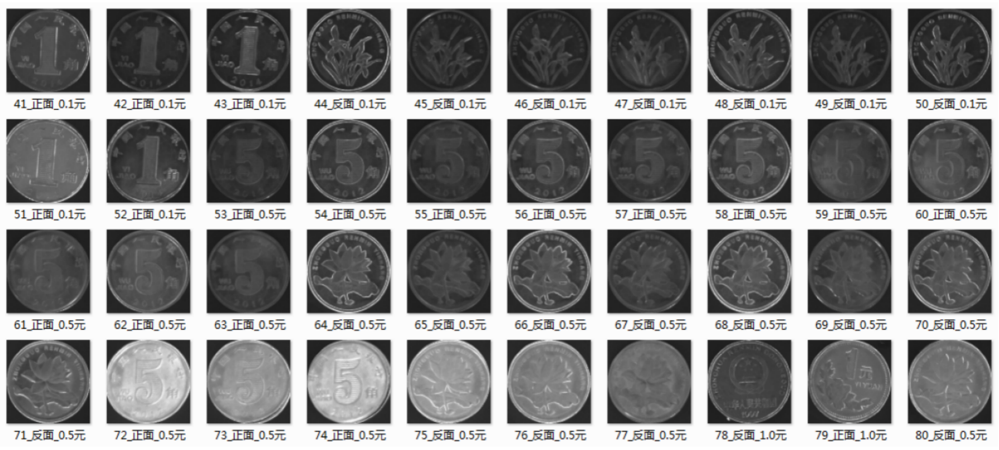
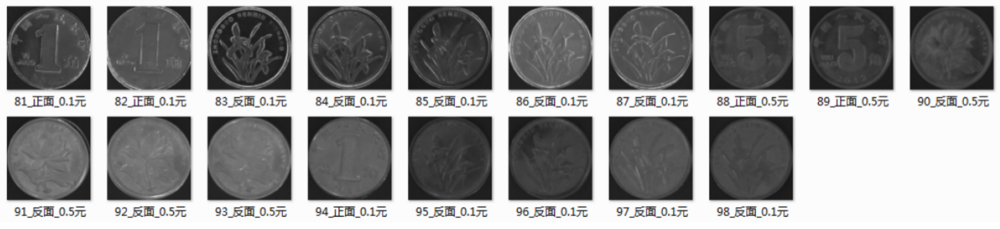

# 硬币识别

识别硬币的面值，正反面，并将其转正。

./src中存放的是硬币的目录，./ans中存放的是结果。

目前只能识别固定场景下的硬币。

识别效果如下图。

# Coin identification

Identify the face value of the coin, positive or negative, and rotate it to the standard apperance.

./src stores the resource coins, and ./ans stores the results.

At present, only coins in a fixed scene can be identified.

The performance can be seen as follows.

